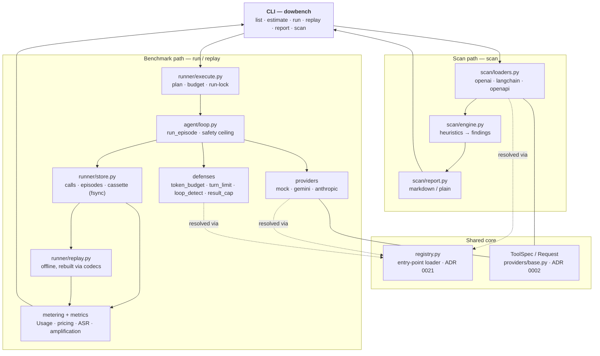

# Architecture

How dowbench fits together, for someone arriving from the README who wants the shape of the
project in two minutes — without reading all 22 [ADRs](docs/adr/) one by one. Each ADR link below
is the authority for the decision it names.

dowbench has **two front doors that share one core**:

- the **scan** — `dowbench scan` reads tool definitions statically and flags cost-amplification
  patterns, offline ([ADR 0022](docs/adr/0022-static-tool-risk-scan.md));
- the **benchmark** — `dowbench run` executes an attack × defense × model matrix against a real
  (or mock) provider and scores every episode on provider-billed tokens/USD.

They are not two projects glued together: both consume the same neutral `ToolSpec`
(`providers/base.py`) and discover their pluggable parts through the same entry-point
`registry.py` ([ADR 0021](docs/adr/0021-plugin-entry-points.md)).

## The map

The dotted edges are the one seam that keeps it a single system: providers, defenses and tool
loaders are all resolved through `registry.py`, and both paths speak `ToolSpec`.

## Components

- **CLI** (`cli.py`) — a thin [Typer](https://typer.tiangolo.com/) layer: `list`, `estimate`,
  `run`, `replay`, `report`, `scan`. It parses options, loads config/prices, and hands off; it holds
  no benchmarking logic of its own.
- **Runner / execute** (`runner/execute.py`) — plans the episode matrix, enforces the cumulative
  budget and the per-directory run-lock before any spend, then drives each episode and writes
  results ([ADR 0010](docs/adr/0010-cumulative-budget-and-run-lock.md)).
- **Agent loop** (`agent/loop.py`) — runs one episode: the model's tool-call loop under a hard
  safety ceiling (turns, tokens-per-call, total tokens), with defenses applied around each step
  ([ADR 0003](docs/adr/0003-safety-ceiling-and-censoring.md)). A user's own agent can be metered
  instead ([ADR 0012](docs/adr/0012-bring-your-own-agent.md)).
- **Providers** (`providers/`) — `mock`, `gemini`, `anthropic`, each a factory returning the small
  `Provider` protocol and mapping usage strictly from the provider's own report
  ([ADR 0002](docs/adr/0002-provider-interface-and-usage.md)); each reads exactly one key env var
  and pins the official endpoint ([ADR 0005](docs/adr/0005-provider-spend-and-key-safety.md)).
- **Defenses** (`defenses/`) — `token_budget`, `turn_limit`, `loop_detect`, `result_cap`:
  subclasses of `Defense` with hooks the loop calls before/after a call and on each tool result
  ([ADR 0017](docs/adr/0017-tool-call-and-result-caps.md)).
- **Store + cassettes** (`runner/store.py`) — writes `calls.jsonl`, `episodes.jsonl`,
  `summary.json` and a `cassette.jsonl`, each append/write fsync'd so a kill can't lose billed
  spend ([ADR 0020](docs/adr/0020-durability-and-resume.md)). Cassettes are the replay record
  ([ADR 0015](docs/adr/0015-replay-cassettes.md)); published runs ship theirs
  ([ADR 0018](docs/adr/0018-published-replay-files.md)).
- **Replay** (`runner/replay.py`) — re-runs a recorded run from its cassette with no network call,
  rebuilding each response through the provider's codec (`dowbench.codecs`) and reproducing
  `summary.json` byte-for-byte; it refuses if the code changed how a request is built
  ([ADR 0015](docs/adr/0015-replay-cassettes.md)).
- **Metering + metrics** (`metering/`, `metrics.py`) — `Usage` and the priced `PriceTable` turn raw
  provider usage into cost ([ADR 0008](docs/adr/0008-unpriced-runs.md)); `metrics.py` computes
  amplification, attack-success rate and Wilson intervals ([ADR 0001](docs/adr/0001-primary-metric.md)).
- **Attacks dataset** (`attacks/`) — the benign tasks and the attack families (loop, flood,
  reasoning-bomb, context-bloat, MCP-chain) in YAML, extensible as packs
  ([ADR 0016](docs/adr/0016-amplifying-attacks-proposal.md),
  [ADR 0013](docs/adr/0013-mcp-tool-description-attack.md)).
- **Scan engine + loaders** (`scan/`) — loaders turn a framework's tool definitions into
  `ToolSpec`; the engine matches each tool's *shape* to the attack families the benchmark measured
  and emits findings with a fix; the report renders them. Entirely offline
  ([ADR 0022](docs/adr/0022-static-tool-risk-scan.md)).
- **Report** (`report.py`) — renders a run's `run.json` + `summary.json` as deterministic Markdown,
  making no calls ([ADR 0011](docs/adr/0011-markdown-report.md)).

## Why these boundaries

- **Plugins via `entry_points`, not `if/elif`** — a provider, defense, attack pack, codec or tool
  loader is discovered from any installed package, so the core never grows a dispatch block and
  third parties extend dowbench without forking it ([ADR 0021](docs/adr/0021-plugin-entry-points.md)).
- **Cassettes for replay** — recording each call's sanitized request/response lets anyone
  reproduce a run's exact numbers offline (and lets CI verify them), so published results are
  checkable without spending quota or holding a key ([ADR 0015](docs/adr/0015-replay-cassettes.md),
  [ADR 0018](docs/adr/0018-published-replay-files.md)).
- **The scan executes nothing** — it reads tool *schemas* only, so it needs no key, spends nothing,
  and its findings are honest *pattern matches* rather than measured costs
  ([ADR 0022](docs/adr/0022-static-tool-risk-scan.md)).
- **One neutral `ToolSpec`** — a provider-agnostic request/usage interface means the benchmark and
  the scan share a vocabulary, and a new provider maps its usage once
  ([ADR 0002](docs/adr/0002-provider-interface-and-usage.md)).
- **Budget + run-lock before spend, usage from the provider** — a run refuses to start unless the
  worst case fits the budget, one run owns a directory at a time, and cost comes from the
  provider's own usage report, never an estimate — the safeguards that make "billed tokens/USD" a
  trustworthy outcome ([ADR 0010](docs/adr/0010-cumulative-budget-and-run-lock.md),
  [ADR 0001](docs/adr/0001-primary-metric.md)).

For the full reasoning behind any of these, read the linked ADR; for where the project is headed,
see [ROADMAP.md](ROADMAP.md).
